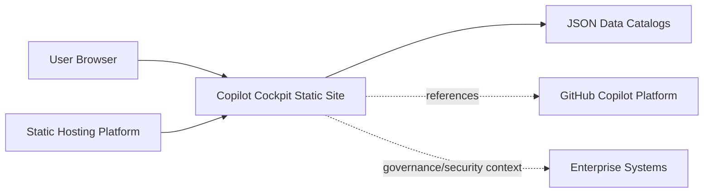

# 02 Architecture Context

## Purpose

This chapter defines system boundaries and external context for Copilot Cockpit.

## System Context

Copilot Cockpit is delivered as a static website. Business value comes from curated and structured feature knowledge, not from backend transactions.

## Mermaid: System Context

## Boundary Definition

Inside boundary:

- Static pages and shared runtime scripts
- Data catalogs loaded at runtime
- Navigation, filtering, deep-linking, and local state

Outside boundary:

- GitHub Copilot backend services
- Identity, billing, and enterprise admin systems
- Proprietary analytics systems not exposed publicly

## External Dependencies

- Static hosting platform (Vercel)
- Browser runtime
- Mermaid and syntax-highlighting libraries
- Playwright test tooling

## Primary Quality Goals

- Clarity and discoverability of feature knowledge
- Integrity of data references
- Reliable perspective-to-perspective navigation
- Low operational overhead

## Constraints

- No heavy framework runtime
- No mandatory backend service dependency for rendering
- Data quality is a first-class reliability concern

## Context Risks

1. Inconsistent taxonomy between catalogs
2. Broken links between perspectives
3. Stale content from external-source drift

## Mitigations

1. Integrity checks in tests
2. Cross-link regression checks
3. Explicit verification status for uncertain sources
