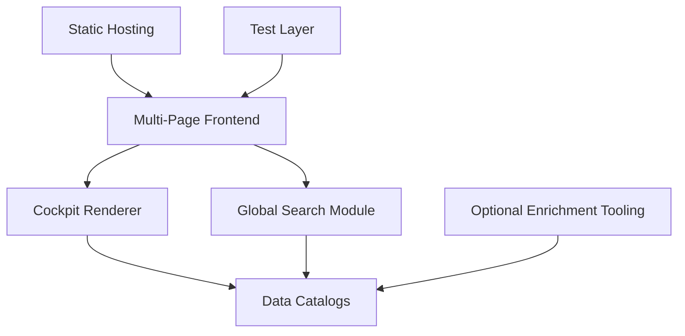

# 03 Component Architecture

## Purpose

This chapter describes the major runtime and governance components.

## Runtime Components

- Multi-page frontend shell
- Cockpit rendering engine
- Global search aggregation
- Perspective-local rendering scripts
- Shared styling and design tokens

## Data Components

- Instrument catalog
- Model catalog
- Governance control catalog
- Security threat and framework catalogs
- Utility catalogs for changelog, preflight, and wiring

## Operational Components

- Static hosting configuration
- Test runner and browser automation
- Optional enrichment tooling for model-data maintenance

## Mermaid: Component Interaction

## Component Responsibilities

| Component | Responsibility | Failure Mode |
| --- | --- | --- |
| Cockpit renderer | Build instrument grid and detail view | Missing or malformed instrument content |
| Search module | Provide unified lookup across catalogs | Incomplete search index or dead target links |
| Perspective pages | Present focused domain views | Inconsistent interpretation of shared taxonomy |
| Data catalogs | Source of structured content | Schema drift and broken references |
| Test layer | Catch runtime and integrity regressions | Coverage gaps around new features |

## Coupling Overview

- Loose coupling between pages through shared IDs and deep links
- Tight semantic coupling on catalog schemas and identifiers

## Design Principles

1. Data first, rendering second
2. Focused perspective pages over one giant page
3. Explicit cross-linking for discoverability
4. Test contracts for critical references
