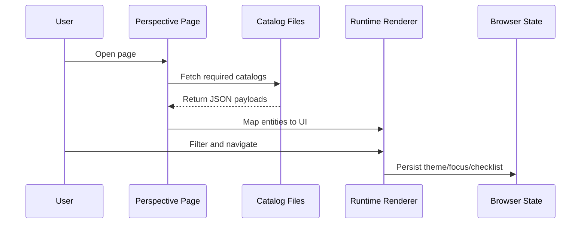
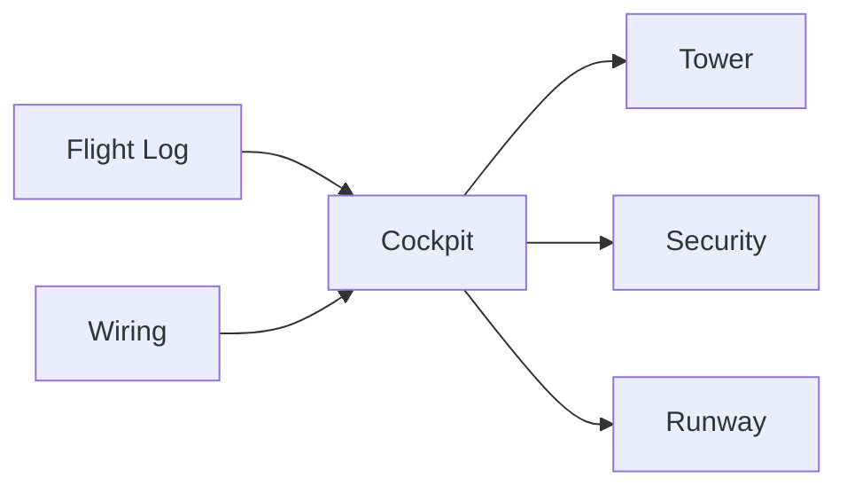

# 04 Data Flows

## Purpose

This chapter explains how data is loaded, transformed, and consumed across perspectives.

## High-Level Flow

1. User opens a perspective page
2. Page loads one or more JSON catalogs
3. Runtime maps catalog entities to UI components
4. User interactions update filters, focus, and deep links
5. Browser state persists selected preferences where applicable

## Mermaid: Runtime Sequence

## Data Categories

- Core catalog data (instruments, models, controls)
- Contextual risk and governance data
- Utility data (changelog, checklist, wiring graph)
- User-side ephemeral state (theme, checklist progress)

## Data Integrity Requirements

1. Stable unique IDs
2. Referential consistency across files
3. Enumerated value consistency for status/tier/type fields
4. Explicit verification flags for uncertain entries

## Cross-Page Flow Contracts

- Instrument IDs must resolve from Flight Log and Wiring back into Cockpit
- Control links must resolve from Cockpit to Tower and Security
- Model references must resolve from Cockpit/Tower into Runway context

## Mermaid: Cross-Page Contracts

## Observed Failure Patterns

- Drift in referenced IDs after content edits
- Missing required fields in new catalog entries
- Navigation targets no longer matching rendered anchors

## Prevention Strategy

- Integrity tests as release gate
- Small, reviewable data changes
- Mandatory update of change notes for semantic taxonomy changes
