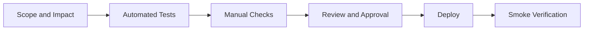
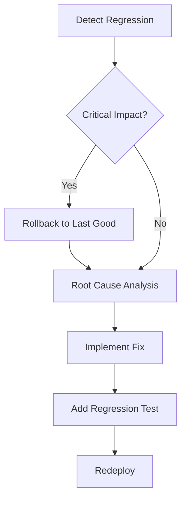

# 07 Deployment and Operations

## Purpose

This chapter defines deployment flow, operational checks, and release readiness.

## Deployment Model

- Static site delivery
- No mandatory build artifact pipeline for page rendering
- Configured cache policy for HTML, JS, CSS, JSON, and media

## Release Workflow

1. Prepare change scope and impact map
2. Execute relevant test suites
3. Run targeted manual checks on affected perspectives
4. Review and approve
5. Deploy and verify smoke checks

## Mermaid: Release Flow

## Operational Readiness Checklist

- All required tests pass
- No unresolved major navigation regressions
- Data integrity checks pass for changed catalogs
- Critical pages render without JS errors

## Rollback Strategy

1. Keep last known good deployment reference
2. Roll back quickly for critical navigation/data regressions
3. Open incident note and attach root-cause hypothesis
4. Add regression test for reproduced failure

## Mermaid: Incident and Rollback Path

## Operational Ownership

- Release owner: to be assigned
- On-call contact model: to be assigned
- Review cadence: at least monthly
