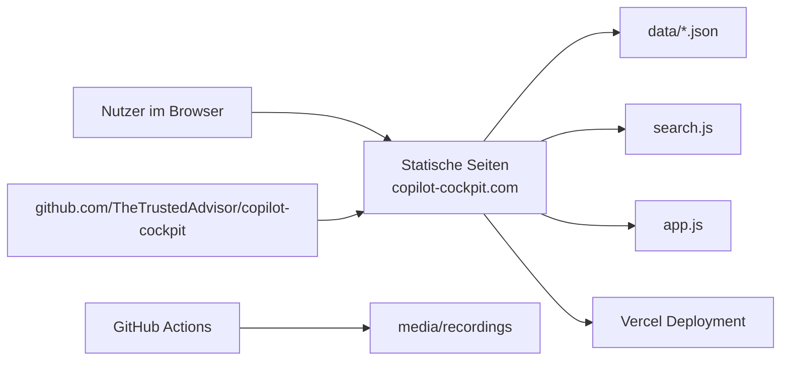
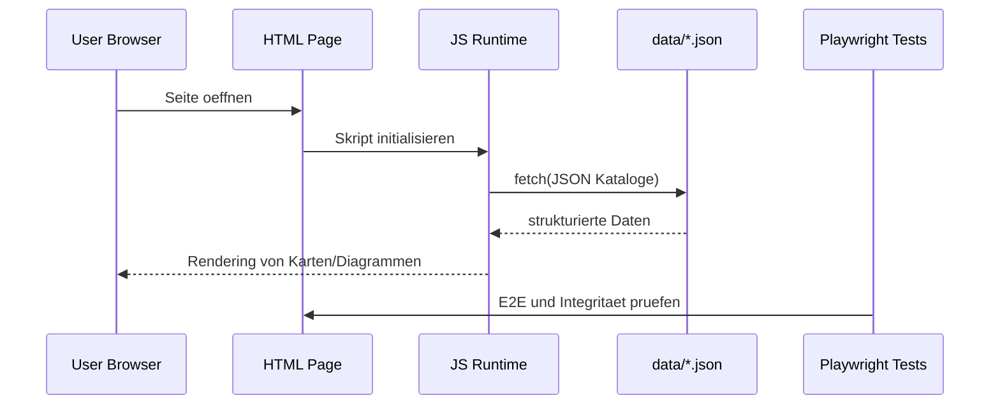

# Copilot Cockpit Repo- und Umgebungsdokumentation (Workbench)

## 1. Dokumentensteuerung

- Titel: Copilot Cockpit Repo- und Umgebungsdokumentation
- Version: 1.0.0
- Datum: 2026-06-01
- Autor/Owner: Workbench Output Branch
- Status: Review abgeschlossen
- Zielumgebung: Lokal (Dev), CI (GitHub Actions), Static Hosting (Vercel)
- Quellenstand:
  - Produkt: https://copilot-cockpit.com/
  - Repository: https://github.com/TheTrustedAdvisor/copilot-cockpit
  - Workbench-Regelwerk: `docs/workbench.md`
  - Ultraplan-Regelwerk: `docs/ultraplan.md`
- Vorlagenbasis: SRS-orientiertes Format nach `SoftwareRequirements.doc` und `System_Requirements_Template.docx`

## 2. Zweck und Scope

Diese Dokumentation beschreibt die technische Struktur, den Betrieb, die Datenbasis, die Risiken und die Verifikation des Projekts Copilot Cockpit.

In Scope:

1. Repo-Architektur und Seitenmodell
2. Datenquellen und deren Verbraucher
3. Deployment- und Betriebsmodell
4. Test- und Verifikationsstrategie
5. Sicherheits- und Governance-Aspekte

Nicht in Scope:

1. Interne, nicht oeffentliche Roadmap
2. Kommerzielle Betriebsdaten ausserhalb oeffentlicher Quellen

## 3. Systemkontext und Business-Kontext

Copilot Cockpit ist eine statische, datengetriebene Referenzplattform fuer GitHub Copilot. Das System nutzt eine Luftfahrtmetapher und bildet Rollen, Arbeitsablaeufe, Modellwahl, Governance und Security als Perspektivseiten ab.

## 4. Stakeholder, Rollen und Benutzermerkmale

- End User: arbeitet mit perspektivenbasierten Seiten und Workflows
- Team Lead: nutzt Uebersichten fuer Priorisierung und Uebergaben
- Operations: bewertet Laufzeitstabilitaet, Runbooks und Verifikation
- Governance/Security: prueft Compliance, Controls und Bedrohungsmuster
- Maintainer: pflegt JSON-Kataloge, Seitenlogik und Testabdeckung

## 5. Funktionale Anforderungen und Hauptfaehigkeiten

1. Statische Multi-Page-Auslieferung ohne Build-Step
2. Datengetriebenes Rendering aus JSON-Katalogen
3. Cross-Page-Deep-Links (Hash-Model)
4. Globales Suchsystem ueber Instrumente, Controls, Modelle, Changelog
5. Mermaid-basierte Visualisierungen in mehreren Perspektiven
6. Security- und Governance-Vertiefung ueber dedizierte Seiten
7. Testbare Navigations- und Integritaetsregeln

## 6. Systembedingungen, Annahmen und Grenzen

Annahmen:

1. Browser mit JavaScript-Unterstuetzung ist vorhanden
2. JSON-Dateien sind gueltig und erreichbar
3. Deployments bleiben statisch und nutzen keine serverseitige API

Grenzen:

1. Kein klassisches Backend und keine transaktionalen API-Endpunkte
2. Datenaktualitaet haengt von Repo-Pflege und Releasefluss ab
3. Teilkataloge tragen weiterhin manuelle Verifikationspflicht (`verificationRequired`)

## 7. Integrationen und Schnittstellen

- Externe Hosting-Schnittstelle: Vercel (statisches Hosting)
- Externe Ressourcen: Mermaid CDN, Prism.js CDN
- Tooling-Schnittstellen: GitHub Actions fuer Media-Aufnahmen
- Interne Datenschnittstellen: JSON-Vertraege unter `data/`

Wichtige Artefaktgruppen:

1. Seiten: `*.html`
2. Laufzeitlogik: `app.js`, `search.js`
3. Daten: `data/*.json`
4. Tests: `tests/*.spec.js`

## 8. Policy-, Compliance- und Sicherheitsanforderungen

- Security-Perspektive mit Threat-Katalog (`security-threats.json`)
- Framework-Registry fuer OWASP LLM, MITRE ATLAS, CWE (`security-frameworks.json`)
- Governance-Controls mit Compliance-Bezug (`governance-controls.json`)
- Souveraenitaets-/Residency-Aspekte (`sovereign-cloud.json`)

Mindesterwartung:

1. Sicherheitskritische Aussagen muessen auf Katalogeintrag oder Testbezug verweisen
2. Compliance- und Governance-Verknuepfungen duerfen nicht entkoppelt werden

## 9. Kapazitaets-, Trainings- und Betriebsanforderungen

- Betriebsmodell: statische Webauslieferung
- Trainingsbedarf: Orientierung ueber `terminal.html`, `jet-bridge.html`, `preflight.html`
- Kapazitaetsprofil: browserseitiges Rendering, keine serverseitige Lastverarbeitung
- Wartungsbedarf: regelmaessige Katalogpflege und Verifikationsrunden

## 10. Initiale Systemarchitektur und Zielumgebung

Architekturprinzip:

- Inhalt in JSON
- Darstellung in HTML/CSS
- Seitenspezifische Steuerung in Vanilla JavaScript

## 11. Datenfluesse, Datenqualitaet und bestehende Systeme

Kernfluss:

1. Seite laedt relevante JSON-Kataloge
2. Skript mappt Daten auf UI-Elemente und Links
3. Nutzerinteraktion erzeugt Filter/Deep-Links/Detailansichten

Datenqualitaetsregeln:

1. Referenzen muessen auf existierende IDs zeigen
2. Pflichtfelder je Katalogduktus muessen vorhanden sein
3. Integritaetspruefung ueber `tests/integrity.spec.js`

Bestehende Systeme:

- GitHub Repo als Source of Truth
- Vercel als Auslieferungspunkt
- CI-Workflow fuer Demo-Aufnahmen

## 12. Test-, Akzeptanz- und Verifikationsstrategie

- Testframework: Playwright
- Umfang: 11 Spec-Dateien, 222 Tests
- Schwerpunkte:
  - Seitensmoke und Rendering
  - Interaktionen und Deep-Links
  - Datenvertrag und Katalogintegritaet

Akzeptanzkriterien fuer Release:

1. Kernseiten laden ohne Laufzeitfehler
2. Deep-Link-Pfade sind stabil
3. Integritaetstests melden keine kritischen Referenzfehler
4. Governance- und Security-Verknuepfungen sind intakt

## 13. Risiken, Entscheidungen und offene Punkte

Hauptrisiken:

1. JSON-Drift zwischen Katalogen und Seitenlogik
2. Veraltete externe Referenzen in Framework-Registry
3. Inkonsistenz zwischen textlicher Doku und Mermaid-Diagrammen

Entscheidungen:

1. Statische Auslieferung ohne Build-Step
2. Kataloggetriebene UI statt serverseitiger API
3. Browserbasierte E2E- und Integritaetsstrategie

Offene Punkte:

1. Kontinuierliche Nachpflege fuer `verificationRequired`-Kataloge
2. Optionales Review auf Link-Lebensdauer externer Framework-Referenzen

## 14. Referenzen, Glossar und Revisionshistorie

Referenzen:

1. https://copilot-cockpit.com/
2. https://github.com/TheTrustedAdvisor/copilot-cockpit
3. `docs/workbench.md`
4. `docs/ultraplan.md`
5. `docs/architecture.md`
6. `docs/data-sources.md`
7. `docs/testing.md`

Glossar (Auszug):

- Workbench: verbindlicher Prozess zur Doku-Erstellung
- Ultraplan: Ralph-orientierter Iterations- und Qualitaetsplan
- Deep Link: URL-Fragment fuer zustandsbehaftete Direktnavigation
- Integrity Test: prueft Konsistenz der Datenkataloge

Revisionshistorie:

- 1.0.0: Initiale Ausgabe auf Branch Output

## 15. Rueckverfolgbarkeit (Anforderung -> Evidenz -> Test)

| Anforderung | Evidenz | Test-/Pruefbezug |
| --- | --- | --- |
| Statische Multi-Page-Architektur | Seiten im Root, kein Build-Output | Smoke-Tests pro Seite |
| Datengetriebenes Rendering | `data/*.json`, seitenspezifische Fetch-Muster | `tests/integrity.spec.js` + Seitentests |
| Querverlinkte Perspektiven | Hash-Deep-Link-Muster und Cross-Page-Navigation | Cockpit/Security/Tower/Runway Tests |
| Governance und Security abgedeckt | `governance-controls.json`, `security-threats.json`, `security-frameworks.json` | `tests/security.spec.js`, `tests/tower.spec.js` |
| Nachvollziehbarer Betrieb | `vercel.json`, Playwright-Konfiguration, Workflow fuer Demos | Deployment- und Testpruefung |

## Workbench- und Ultraplan-Nachweis

Diese Dokumentation wurde nach Workbench und Ultraplan erstellt.
Der Ralph-Zyklus und der Score-Nachweis sind in den Quality-Artefakten dokumentiert:

1. `docs/quality/rubric.md`
2. `docs/quality/scorecard.md`
3. `docs/quality/iteration-log.md`
