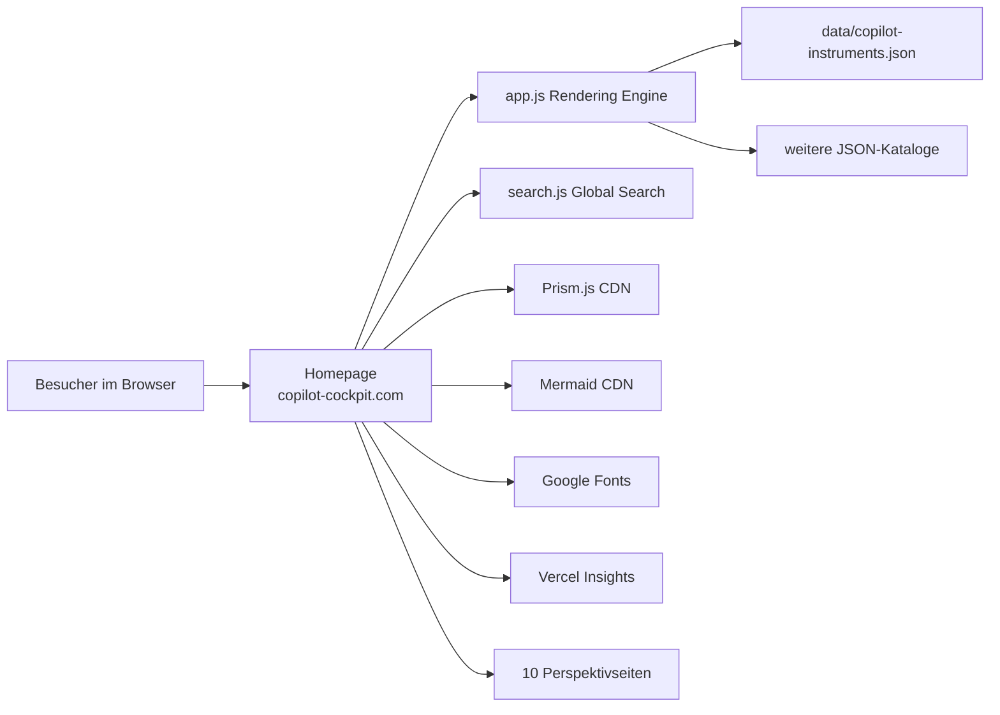
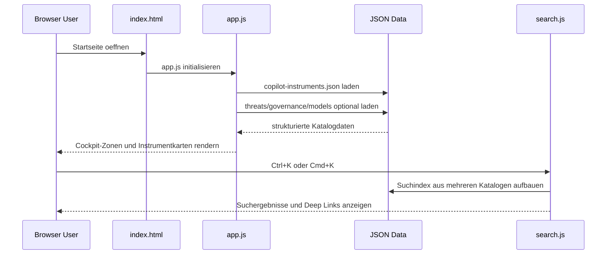

# Copilot Cockpit Site-Dokumentation (Workbench)

## 1. Dokumentensteuerung

- Titel: Copilot Cockpit Site-Dokumentation
- Version: 1.0.0
- Datum: 2026-06-01
- Autor/Owner: Workbench Output Branch
- Status: Review abgeschlossen
- Zielumgebung: Oeffentliche Website, Browser-Client, statisches Hosting
- Quellenstand:
  - Produktseite: `https://copilot-cockpit.com/`
  - Laufzeitlogik: `https://copilot-cockpit.com/app.js`
  - Suche: `https://copilot-cockpit.com/search.js`
  - Datengrundlage: `https://copilot-cockpit.com/data/copilot-instruments.json`
  - Workbench-Regelwerk: `docs/workbench.md`
  - Ultraplan-Regelwerk: `docs/ultraplan.md`
- Vorlagenbasis: SRS-orientiertes Format nach `SoftwareRequirements.doc` und `System_Requirements_Template.docx`

## 2. Zweck und Scope

Diese Dokumentation beschreibt die oeffentliche Seite `https://copilot-cockpit.com/` als interaktive Referenzoberflaeche fuer GitHub Copilot.
Der Fokus liegt auf dem sichtbaren Verhalten der Seite, ihren clientseitigen Abhaengigkeiten, Datenquellen und Qualitaetsanforderungen.

In Scope:

1. Header-, Navigations- und Filterverhalten der Startseite
2. Clientseitige Daten- und Suchlogik
3. Externe Abhaengigkeiten, Hosting- und Laufzeitannahmen
4. Mermaid-gestuetzte Visualisierung des Seitenkontexts und des Datenflusses
5. Traceability fuer sichtbare Hauptfaehigkeiten

Nicht in Scope:

1. Nicht verlinkte interne Admin- oder Autorenprozesse
2. Serverseitige Backends, da auf der Seite keine erkennbar sind
3. Nicht oeffentlich zugaengliche Betriebsdaten

## 3. Systemkontext und Business-Kontext

Copilot Cockpit praesentiert GitHub-Copilot-Funktionen als interaktive HUD-Oberflaeche mit Luftfahrtmetapher.
Die Startseite dient als zentrales Cockpit fuer Instrumente, Filter, Detailansichten und Navigation in zehn Perspektiven.

Sichtbare Kernbotschaft laut Metadaten:

1. Interaktive Referenz fuer GitHub Copilot
2. 46 Instrumente ueber 10 Perspektiven
3. Datengetriebene, browserseitig gerenderte Darstellung

## 4. Stakeholder, Rollen und Benutzermerkmale

- Besucher: will GitHub-Copilot-Funktionen schnell nach Rolle, Plan und Reifegrad erkunden
- Lernende und Teams: nutzen die Seite als Referenz, Navigationshilfe und Deep-Link-Ziel
- Maintainer: pflegen JSON-Kataloge, Perspektivseiten und konsistente Verweise
- Autor/Publisher: betreibt die Seite als oeffentliche Wissensbasis mit Branding und Feedback-Link

Benutzermerkmale:

1. Browsernutzung mit aktivem JavaScript ist vorausgesetzt
2. Die Zielgruppe reicht von Beginner (`VFR`) bis Admin (`ATC`)
3. Nutzer erwarten schnelle Filterung, Volltextsuche und klickbare Detailpanels

## 5. Funktionale Anforderungen und Hauptfaehigkeiten

1. Die Startseite zeigt eine Cockpit-Oberflaeche mit Instrumentkarten und Zonen.
2. Die Kopfzeile bietet Direktnavigation zu zehn Perspektiven: Terminal, Security, Jet Bridge, Ramp, Cockpit, Runway, Tower, Flight Log, Pre-Flight und Wiring.
3. Filterleisten muessen nach `Flight Mode`, `Plan` und `Status` filtern koennen.
4. Das Suchfeld auf der Seite muss Instrumente filtern; zusaetzlich stellt `search.js` eine globale Command-Palette via `Ctrl+K` oder `Cmd+K` bereit.
5. Ein Klick auf eine Instrumentkarte oeffnet ein Detail-Panel mit kontextabhaengigen Tabs wie Overview, Diagrams, Code, Media und Resources.
6. Die Seite zeigt Statusindikatoren (`GA`, `Preview`, `Deprecated`) und sichtbare Systemzustandsinformationen wie `SYS ONLINE`.
7. Ein Theme-Toggle muss zwischen Darstellungsmodi umschalten koennen.

## 6. Systembedingungen, Annahmen und Grenzen

Annahmen:

1. Die Seite wird statisch ausgeliefert und im Browser ausgefuehrt.
2. JavaScript ist aktiviert; ohne JavaScript weist ein `noscript`-Hinweis auf die Einschraenkung hin.
3. Die referenzierten JSON-Dateien und CDNs sind erreichbar.

Grenzen:

1. Es ist kein sichtbares serverseitiges API- oder Login-System vorhanden.
2. Inhaltliche Aktualitaet haengt von den bereitgestellten JSON-Katalogen und HTML-/JS-Dateien ab.
3. Die Seite ist auf externe Assets wie Mermaid, Prism und Google Fonts angewiesen.

## 7. Integrationen und Schnittstellen

Interne Schnittstellen:

1. `app.js` laedt `data/copilot-instruments.json` sowie weitere JSON-Kataloge fuer Security, Governance und Modelle.
2. `search.js` baut einen globalen Suchindex aus Instrumenten, Governance-Controls, Modellen und Changelog-Eintraegen.
3. Die Startseite verlinkt auf perspektivenspezifische HTML-Seiten und nutzt Hash-Fragmente fuer Deep Links.

Externe Schnittstellen:

1. CDN fuer Mermaid (`cdn.jsdelivr.net`)
2. CDN fuer Prism.js Syntax-Highlighting
3. Google Fonts fuer JetBrains Mono
4. Vercel Analytics (`/_vercel/insights/script.js`) und Speed Insights
5. Externe Footer-Links zu LinkedIn, Homepage, YouTube, GitHub und Feedback-Issue

## 8. Policy-, Compliance- und Sicherheitsanforderungen

1. Externe Links im Footer nutzen `target="_blank"` mit `rel="noopener"`, was ein Mindestmass an sicherer Link-Isolation bietet.
2. Da keine sichtbaren Formulare, Logins oder Schreiboperationen vorhanden sind, sind Anforderungen an Authentifizierung und Session-Management fuer diese Seite **Not Applicable**.
3. Die Abhaengigkeit von externen CDNs erfordert einen bewussten Umgang mit Verfuegbarkeit, Datenschutz und Supply-Chain-Risiken.
4. Die Seite sollte keine sicherheitskritischen Aussagen ohne verlinkte Evidenz in den zugrunde liegenden Datenkatalogen darstellen.

## 9. Kapazitaets-, Trainings- und Betriebsanforderungen

- Betriebsmodell: statische Webauslieferung mit clientseitigem Rendering
- Kapazitaetsprofil: die Rechenlast liegt primaer im Browser; serverseitig ist nur statisches Ausliefern sichtbar
- Trainingsbedarf: gering bis mittel, da Navigation, Flight-Modes und Perspektiven erklaerungsbeduerftig sein koennen
- Support-Hinweis: Feedback ist ueber den sichtbaren GitHub-Issue-Link vorgesehen

## 10. Initiale Systemarchitektur und Zielumgebung

Die Zielumgebung ist ein Browser-Client, der HTML, CSS, JavaScript und JSON-Ressourcen ueber statisches Hosting laedt.
Die Seite rendert ihr Kernlayout leer vor und fuellt Instrumente, Details und Suchdaten erst nach dem Laden der Datenquellen.

## 11. Datenfluesse, Datenqualitaet und bestehende Systeme

Kern-Datenfluss:

1. `index.html` bindet `app.js` und `search.js` ein.
2. `app.js` laedt Haupt- und Zusatzkataloge via `fetch(...)`.
3. Die Laufzeit mappt Zonen, Instrumentkarten, Statusanzeigen und Details in das DOM.
4. `search.js` erstellt bei Bedarf einen quellenuebergreifenden Suchindex.

Datenqualitaetsregeln:

1. Instrumente brauchen konsistente IDs, Statuswerte und Zonenzuordnungen.
2. Deep Links muessen auf existierende Instrument- oder Zielseiten zeigen.
3. Zusatzkataloge duerfen als Soft-Fail fehlen, ohne die Startseite komplett unbenutzbar zu machen.

Bestehende Systeme:

1. Statische Website `copilot-cockpit.com`
2. Vercel als sichtbarer Hosting-/Telemetry-Kontext
3. Externe CDNs fuer Rendering- und Syntax-Assets

## 12. Test-, Akzeptanz- und Verifikationsstrategie

Empfohlene Verifikation fuer diese Seite:

1. `GET https://copilot-cockpit.com/` liefert HTML mit Title, Header und Filterleiste.
2. `app.js` laedt mindestens `data/copilot-instruments.json` erfolgreich.
3. Die Navigation zeigt alle zehn Perspektivlinks.
4. Die Filter `Flight Mode`, `Plan` und `Status` sind sichtbar und interaktiv.
5. `Ctrl+K` oder `Cmd+K` oeffnet die globale Suche.
6. Ein Instrumentklick oeffnet ein Detail-Panel mit inhaltabhaengigen Tabs.

Akzeptanz fuer Dokumentationsfreigabe:

1. Alle Pflichtkapitel aus Workbench sind belegt oder als `Not Applicable` begruendet.
2. Mindestens zwei Mermaid-Diagramme erklaeren Systemkontext und Laufzeitfluss.
3. Workbench und Ultraplan werden explizit referenziert.
4. Ralph-Score fuer diesen Auftrag liegt bei mindestens 90%.

## 13. Risiken, Entscheidungen und offene Punkte

Hauptrisiken:

1. Starke Abhaengigkeit von JavaScript und externen CDNs
2. Inkonsistenz zwischen HTML-Metadaten, JSON-Katalogen und sichtbarem UI
3. Begrenzte Transparenz ueber Analytics- und Datenschutzkonfiguration nur anhand der Seite

Sichtbare Entscheidungen:

1. Datengetriebenes Frontend statt statischer Hardcoding-Landing-Page
2. Luftfahrtmetapher als zentrale Navigations- und Erklaerstruktur
3. Detail-Panel und Deep-Link-Modell fuer wiederverwendbare Navigation

Offene Punkte:

1. Die genaue Telemetrie- und Consent-Strategie ist aus der oeffentlichen Seite allein nicht vollstaendig ableitbar.
2. Barrierefreiheitsanforderungen sind nur teilweise aus HTML-Markup und Tastaturhinweisen ersichtlich.
3. Aussagen ueber Backend- oder Deployment-Policies bleiben ohne weitere Quellen bewusst offen.

## 14. Referenzen, Glossar und Revisionshistorie

Referenzen:

1. `https://copilot-cockpit.com/`
2. `https://copilot-cockpit.com/app.js`
3. `https://copilot-cockpit.com/search.js`
4. `https://copilot-cockpit.com/data/copilot-instruments.json`
5. `docs/workbench.md`
6. `docs/ultraplan.md`

Glossar:

- Workbench: verbindlicher Prozess fuer Dokumentationsauftraege
- Ultraplan: Ralph-orientierter Iterations- und Qualitaetsrahmen
- Instrument: einzelne Copilot-Funktion oder Referenzeinheit im Cockpit
- Deep Link: Fragment- oder Zielnavigation zu Detailansichten
- Command Palette: globale Suche via `Ctrl+K` oder `Cmd+K`

Revisionshistorie:

- 1.0.0: Initiale Seiten-Dokumentation auf Branch `Output`

## 15. Rueckverfolgbarkeit (Anforderung -> Evidenz -> Test)

| Anforderung | Evidenz | Test-/Pruefbezug |
| --- | --- | --- |
| Cockpit-HUD mit Instrumentkarten | `index.html` Grundlayout, `app.js` rendert `cockpit-grid` | Seite laedt sichtbare Grid-Zonen |
| Filter fuer Flight Mode, Plan und Status | HTML-Filterleiste mit `data-filter-*` Buttons | Sichtpruefung und UI-Interaktion |
| Datengetriebenes Rendering | `app.js` laedt `copilot-instruments.json` und Zusatzkataloge | Netzwerk- und Renderingpruefung |
| Globale Suche ueber mehrere Quellen | `search.js` baut Index fuer Instrumente, Controls, Modelle und Changelog | `Ctrl+K`/`Cmd+K` und Ergebnisliste |
| Navigation ueber zehn Perspektiven | Header-Navigation mit zehn Links | Link- und Navigationspruefung |
| Sichere externe Linkoeffnung | Footer-Links mit `rel="noopener"` | HTML-Attributpruefung |

## Workbench- und Ultraplan-Nachweis

Diese Dokumentation wurde nach Workbench und Ultraplan erstellt.
Der Ralph-Zyklus und der Score-Nachweis fuer diesen Seitenauftrag sind in den Quality-Artefakten dokumentiert:

1. `docs/quality/rubric.md`
2. `docs/quality/scorecard.md`
3. `docs/quality/iteration-log.md`
