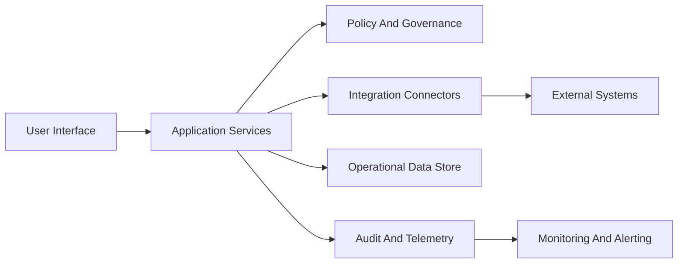
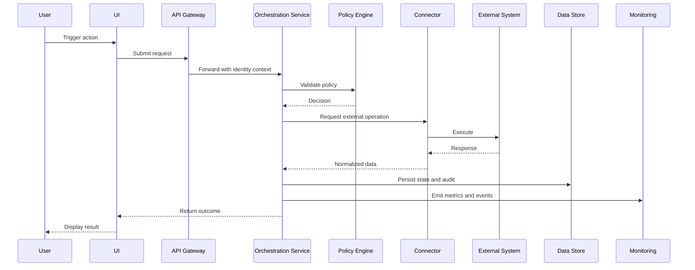

# Copilot Cockpit Technical Documentation

## Architecture Overview

Copilot Cockpit uses a layered architecture to separate user interaction, business logic, and platform operations.
The design goal is predictable behavior, traceability, and safe integration with enterprise systems.

Key architecture characteristics:

- UI layer for role-based interaction and guided execution.
- Service layer for orchestration, policy checks, and domain logic.
- Integration layer for external systems and connectors.
- Data layer for operational state, analytics, and audit records.
- Platform layer for identity, observability, deployment, and runtime controls.

## Core Components

- Web UI: renders user and role-specific views, input handling, and guided workflows.
- API Gateway: central request entry point, routing, and basic protection controls.
- Orchestration Services: executes workflow logic, action sequencing, and retries.
- Policy Engine: enforces role, security, and compliance constraints.
- Connector Services: normalize and exchange data with external systems.
- Data Services: persist operational state, metadata, and historical events.
- Telemetry Pipeline: captures logs, metrics, traces, and audit events.

## Data Flows

Primary request and action flow:

1. User initiates an action in the UI.
2. Request passes through gateway and identity checks.
3. Orchestration service validates policy and required context.
4. Connector calls external systems when needed.
5. Results are persisted, audited, and returned to the UI.
6. Monitoring receives status and performance signals.

## Integrations

Copilot Cockpit integrates with enterprise platforms through managed connectors and API contracts.

Typical integration categories:

- Identity providers for authentication and role claims.
- Ticketing or workflow systems for action lifecycle updates.
- Knowledge or data services for enrichment and retrieval.
- Notification channels for operational and user alerts.

Integration guidance:

- Use contract versioning for backward-compatible changes.
- Apply retries with bounded backoff for transient failures.
- Record correlation ids across boundaries for traceability.

## Security And Compliance

Security controls are applied across identity, transport, data, and operations.

- Authentication and authorization: enforce role-based access at gateway and service boundaries.
- Data protection: encrypt data in transit and at rest.
- Auditability: log sensitive actions with actor, timestamp, and policy context.
- Least privilege: restrict service and connector permissions to required scope.
- Compliance posture: maintain retention, access review, and evidence collection workflows.

Operational expectations:

- Security events are visible in monitoring and routed to incident processes.
- Compliance checks are integrated into deployment and periodic review cycles.

## Deployment And Operations

Environment model generally follows dev, test, and production tiers.

- Build artifacts are immutable and promoted between environments.
- Configuration is environment-specific and externally managed.
- Health checks gate rollout and rollback decisions.
- Observability baselines include service latency, error rate, and queue depth.

Release practices:

- Prefer progressive rollout with clear rollback triggers.
- Validate migrations and connector health before production traffic shift.

## Testing And Quality

Quality is enforced with layered validation:

- Unit tests for service logic and policy decisions.
- Integration tests for connector contracts and failure handling.
- End-to-end tests for key user workflows.
- Non-functional tests for performance, resilience, and security controls.

Recommended quality gates:

- All critical tests pass before merge.
- No unresolved high-severity security findings.
- Observability and audit checks pass in target environment.

## Runbook Entry Point

Use runbooks when handling incidents, degraded performance, or connector failures.
Start with:

1. Identify affected component and impact scope.
2. Check telemetry, error signatures, and recent changes.
3. Apply the mapped recovery action.
4. Verify service health and user-visible recovery.
5. Record incident timeline and follow-up actions.

If no known runbook path matches, escalate with logs, correlation ids, and policy decision context.