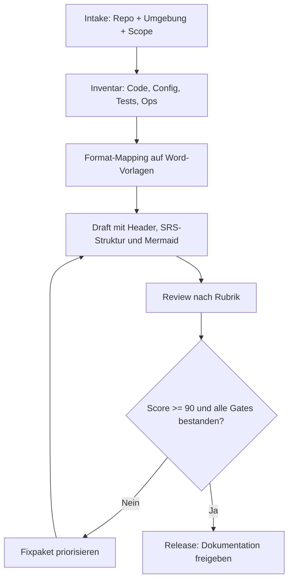
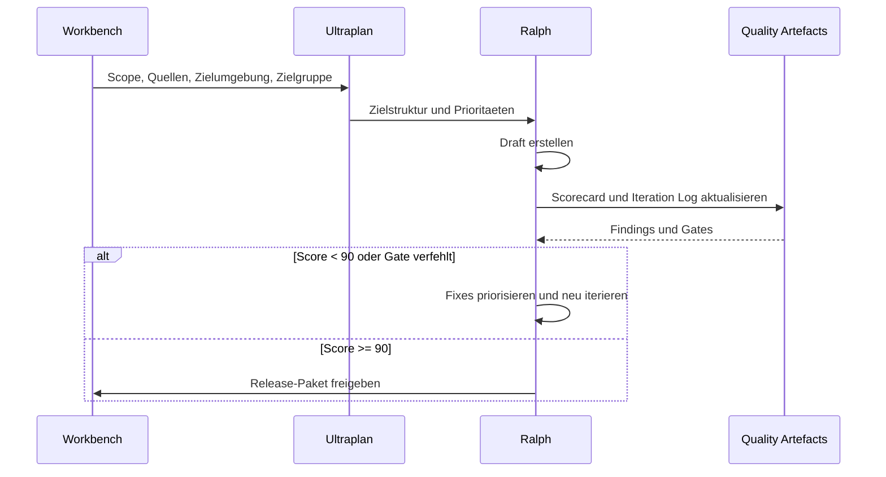

# Ultraplan fuer Workbench-Dokumentation

## Ziel

Mit Ralph-Iterationen technische Dokumentation aus Repositories und Zielumgebungen erzeugen,
bis die Qualitaetsanforderung von mindestens 90% erreicht ist.

Der Ultraplan ist wiederverwendbar und gilt fuer Repo-Dokumentation, Umgebungsdokumentation und kombinierte Systemdokumentation.

## Prozessvisualisierung (Mermaid)

## Ralph-Zyklus als Sequenz

## Verbindliches Ausgabeformat pro Dokumentationsauftrag

Jede erzeugte Dokumentation muss in folgender Reihenfolge auslieferbar sein:

1. Dokumentenheader
2. Dokumentensteuerung und Revisionsstand
3. Zweck und Scope
4. Systemkontext / aktuelles Systembild
5. Stakeholder, Rollen, Benutzermerkmale
6. Hauptfaehigkeiten und funktionale Anforderungen
7. Bedingungen, Annahmen, Grenzen
8. Integrationen und Schnittstellen
9. Policy-, Compliance- und Sicherheitsanforderungen
10. Trainings-, Kapazitaets- und Betriebsanforderungen
11. Initiale Architektur und Zielumgebung
12. Datenfluesse / Datenqualitaet / Current-System-Analyse
13. Test-, Akzeptanz- und Verifikationsstrategie
14. Risiken, Entscheidungen, offene Punkte
15. Referenzen, Glossar, Anhaenge
16. Rueckverfolgbarkeit

Wenn ein Kapitel nicht anwendbar ist, bleibt es im Dokument erhalten und wird mit Begruendung als `Not Applicable` markiert.

## Ralph-Zyklus

Jede Iteration folgt strikt:

1. Plan: Fehlende Inputs, Zielkapitel und Risiken festziehen
2. Draft: Kapitelstruktur, Quellenbindung und Mermaid erstellen
3. Review: Rubrik anwenden und Defizite belegen
4. Fix: Hohe Gewichte und verfehlte Gates zuerst schliessen
5. Verify: Scorecard und Iterationslog aktualisieren

Regeln:

1. Nach jeder Iteration Scorecard aktualisieren
2. Bei Score < 90 ist eine weitere Iteration zwingend
3. Fixes zuerst auf Defizitkriterien mit hohem Gewicht
4. Jede Kernanforderung braucht Text, Evidenz und Test-/Pruefbezug
5. Mermaid-Diagramme duerfen nicht nur dekorativ sein, sondern muessen den Text erklaeren

## Qualitaetsrubrik

Bewertung pro Kriterium auf Skala 0-5.

| Kriterium | Gewicht | Mindestwert |
| --- | ---: | ---: |
| Vollstaendigkeit | 25% | 4.5 |
| Korrektheit | 25% | 4.5 |
| Nachvollziehbarkeit | 20% | 4.0 |
| Wartbarkeit | 15% | 4.0 |
| Verifizierbarkeit | 15% | 4.0 |

Formel:

`Gesamtscore = Summe((Punkte/5) * Gewicht)`

Harte Exit-Kriterien:

1. Gesamtscore >= 90%
2. Kein Kriterium unter Mindestwert
3. Mermaid-Diagramme fachlich korrekt und konsistent mit Text
4. Rueckverfolgbarkeit fuer Kernanforderungen vorhanden
5. Workbench und Ultraplan im Ergebnis explizit verwendet

## Iterationsstrategie

### Iteration 1

- Fokus: Kapitelstruktur und Template-Fit
- Hauptrisiko: fehlende Repo- oder Umgebungsinputs

### Iteration 2

- Fokus: Korrektheit, Evidenz und Querverweise
- Hauptrisiko: Anforderungen ohne belastbare Quelle

### Iteration 3

- Fokus: Mermaid-Konsistenz, Traceability und Betriebsbild
- Hauptrisiko: Diagramme oder Datenfluesse widersprechen dem Text

### Iteration 4+

- Fokus: Restdefizite auf Gates und Stilkonstanz reduzieren
- Wiederholen bis alle Gates bestanden sind

## Verbindliche Artefakte pro Auftrag

1. Zieldokument(e)
2. Aktualisierte Scorecard (`docs/quality/scorecard.md`)
3. Iterationsprotokoll (`docs/quality/iteration-log.md`)
4. Rubrikbezug (`docs/quality/rubric.md`)
5. Verweis auf Workbench und Ultraplan

## Dauerhafte Regel

Bei jeder neuen Anfrage zur Dokumentationserstellung muessen Workbench und Ultraplan aktiv verwendet und im Ergebnis referenziert werden.
