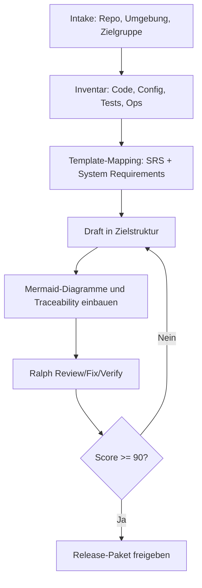

# Workbench fuer Repo- und Umgebungsdokumentation

## Zweck

Die Workbench ist der verpflichtende Arbeitsmodus fuer jede neue Dokumentation.
Bei jeder Anfrage zur Dokumentationserstellung muessen immer diese zwei Artefakte aktiv sein:

1. Workbench (dieses Dokument)
2. Ultraplan (`docs/ultraplan.md`)

Die Benennung des Dokumentationsmodus ist verbindlich: **Workbench** ist der Standardname fuer diesen wiederverwendbaren Prozess.

## Prozessvisualisierung (Mermaid)

## Eingaben

Pro Dokumentationsauftrag muessen mindestens folgende Inputs vorliegen:

- Ziel-Repository (URL oder lokaler Pfad)
- Zielumgebung (lokal, CI, Cloud, on-prem, Hybrid)
- Scope (User-Doku, Technical Doku, Betriebsdoku oder Mischform)
- Zielgruppe und Owner
- Verbindliche Quellen (Code, Config, Tests, Pipelines, Runbooks, ADRs, Tickets)
- Vorlagenanforderung (SRS-Format nach `SoftwareRequirements.doc` und `System_Requirements_Template.docx`)

Wenn ein Input fehlt, muss die Luecke vor dem Draft explizit markiert oder geklaert werden. "Nicht anwendbar" ist erlaubt, aber nur mit Begruendung.

## Verbindlicher Dokumentenheader

Jede erzeugte Doku startet mit:

- Titel
- Version
- Datum
- Autor/Owner
- Quellenstand
- Zielumgebung
- Status (Draft, Review, Approved)
- Referenzierte Vorlagenbasis

## Formatstandard (Best Practices + Word-Vorlagen)

Die Ausgabe richtet sich an bewaehrten SRS-Prinzipien aus `SoftwareRequirements.doc` und `System_Requirements_Template.docx`.
Die resultierende Kapitelstruktur muss sowohl klassische SRS-Bausteine als auch Umgebungs-, Betriebs- und Akzeptanzaspekte tragen.

### Verbindliche Kapitelreihenfolge

1. Dokumentensteuerung
2. Zweck und Scope
3. Systemkontext und Business-Kontext
4. Stakeholder, Rollen und Benutzermerkmale
5. Funktionale Anforderungen und Hauptfaehigkeiten
6. Systembedingungen, Annahmen und Grenzen
7. Integrationen und Schnittstellen
8. Policy-, Compliance- und Sicherheitsanforderungen
9. Kapazitaets-, Trainings- und Betriebsanforderungen
10. Initiale Systemarchitektur und Zielumgebung
11. Datenfluesse, Datenqualitaet und bestehende Systeme
12. Test-, Akzeptanz- und Verifikationsstrategie
13. Risiken, Entscheidungen und offene Punkte
14. Referenzen, Glossar und Revisionshistorie
15. Rueckverfolgbarkeit (Anforderung -> Evidenz -> Test)

### Mapping auf die beiden Word-Vorlagen

| Workbench-Kapitel | `SoftwareRequirements.doc` | `System_Requirements_Template.docx` |
| --- | --- | --- |
| Dokumentensteuerung | Revisions / Review & Approval | Document Revision History / Approval |
| Zweck und Scope | Introduction / Scope of this Document | Section 1 Purpose |
| Systemkontext | General Description / Business Context | Section 9 Current System Analysis |
| Rollen und Benutzer | User Characteristics / User Objectives | 2.4 System User Characteristics |
| Funktionale Anforderungen | Functional Requirements | 2.1 Major System Capabilities |
| Bedingungen und Grenzen | General Constraints / Operational Scenarios | 2.2 Major System Conditions |
| Schnittstellen | Interface Requirements | 2.3 System Interfaces |
| Sicherheit und Compliance | Security / Other non-functional attributes | Section 3 Policy and Regulation, Section 4 Security |
| Betrieb und Architektur | Performance / Operational Scenarios | Sections 5-7 Training, Capacity, Initial System Architecture |
| Akzeptanz und Verifikation | Sequence Diagrams / Appendices | Section 8 System Acceptance Criteria |
| Referenzen und Glossar | Definitions, Acronyms, Abbreviations | Sections 10-13 References, Glossary, Revision History, Appendices |

## Mermaid-Pflicht

Jede technische Dokumentation muss mindestens zwei Mermaid-Diagramme enthalten:

1. Kontextdiagramm (`flowchart` oder `graph`)
2. Sequenz-, Zustands- oder Datenflussdiagramm (`sequenceDiagram`, `stateDiagram-v2` oder `flowchart`)

Empfohlene Zusatzelemente:

- Abhaengigkeitsdiagramm fuer externe Services
- Deployment- oder Betriebszustandsdiagramm

## Release-Paket pro Auftrag

Jeder Dokumentationsauftrag liefert mindestens:

1. Ziel-Dokument(e) im Workbench-Format
2. Verweis auf verwendete Quellen
3. Mermaid-Diagramme
4. Aktualisierte Scorecard (`docs/quality/scorecard.md`)
5. Aktualisiertes Iterationsprotokoll (`docs/quality/iteration-log.md`)
6. Rubrikbezug (`docs/quality/rubric.md`)

## Workbench-Ablauf pro Auftrag

1. Intake: Scope, Zielumgebung und Quellen fixieren
2. Inventar: Dateien, Komponenten, Laufzeitpfade, Deployments und Tests erheben
3. Mapping: Inhalte auf die Zielkapitel der beiden Vorlagen mappen
4. Draft: Erstfassung mit Dokumentenheader und Mermaid erstellen
5. Ralph-Iteration: Review/Fix/Verify via Ultraplan
6. Release: Nur bei Score >= 90 und bestandenen Gates

## Definition of Done

Ein Dokumentationsauftrag ist nur fertig, wenn:

1. Workbench-Schritte durchlaufen wurden
2. Ultraplan-Gates bestanden wurden
3. Score >= 90 erreicht ist
4. Kein Muss-Kriterium unter seinem Gate liegt
5. Mermaid-Diagramme gerendert und fachlich korrekt sind
6. Nicht anwendbare Kapitel explizit begruendet wurden
